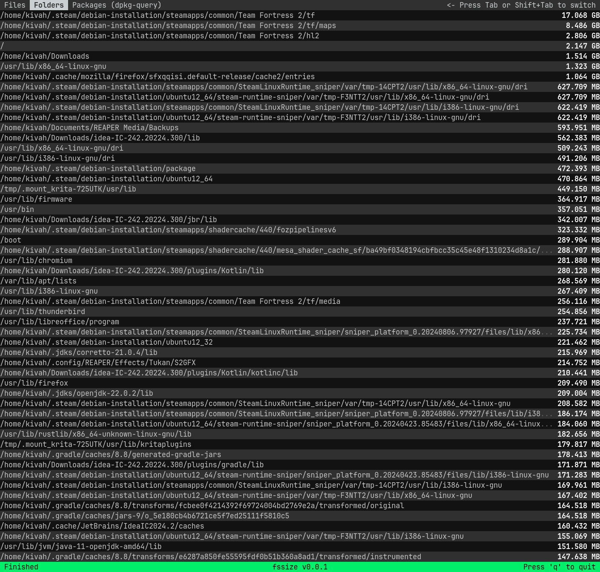

Low on disk space? Use this tool to find the biggest files and folders on your Linux machine

[The command-line parser stops parsing after the first non-option](https://stackoverflow.com/a/25113485).\
This is valid:\
`fssize --ignore-hidden-files .`

While this will not ignore hidden files:\
`fssize . --ignore-hidden-files`

# Known issues
Selecting an area with the mouse (atleast in xterm) can hang the application until it is unselected or a key is pressed
